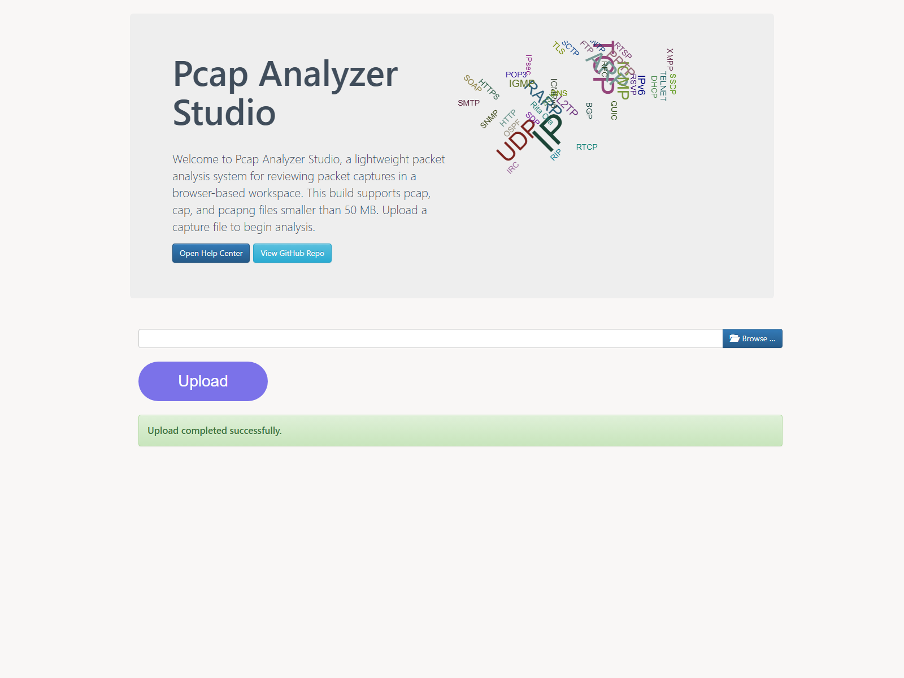
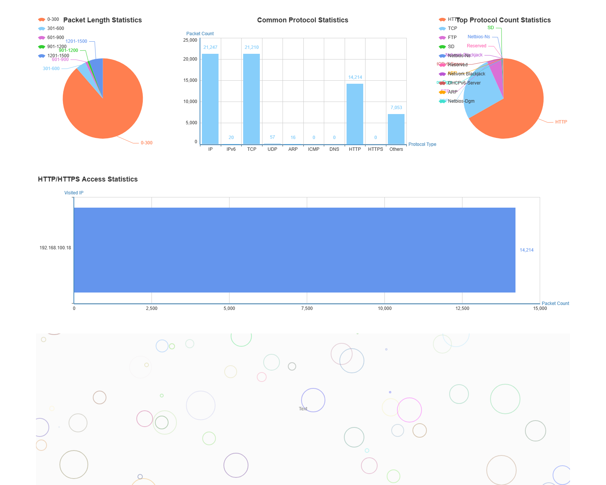
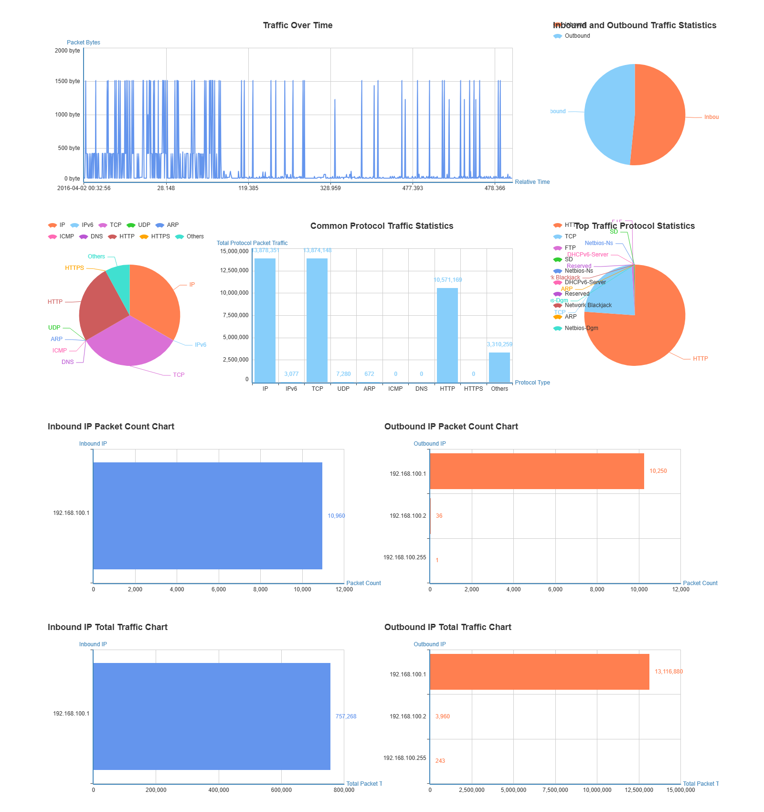
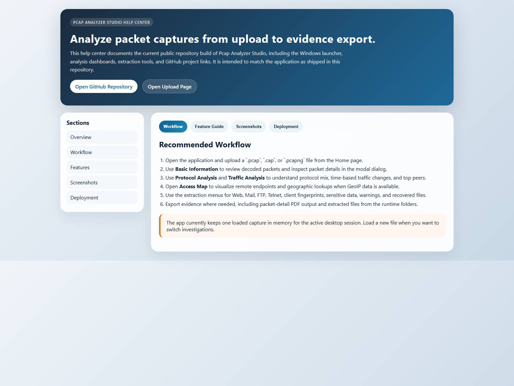

# Pcap Analyzer Studio

Pcap Analyzer Studio is a browser-based packet-capture analysis workstation built with Flask and Scapy. It lets you upload a capture file, inspect decoded packets, chart protocol and traffic patterns, recover session data, extract transferred files, and review warning indicators from one local web interface.

This repository is the public home for the maintained Windows-friendly edition:
[https://github.com/Ayman-Elbanhawy/Pcap-AnalyzerStudio](https://github.com/Ayman-Elbanhawy/Pcap-AnalyzerStudio)

## Features

- Packet table view with protocol, source, and destination filtering
- Packet-detail modal with PDF export
- Protocol dashboards for common protocols, DNS, and HTTP or HTTPS activity
- Traffic dashboards for time-series, direction, peers, and byte volume
- Geographic access map for remote IP endpoints
- Session extraction for Web, Mail, FTP, and Telnet traffic
- Sensitive-data and client-information extraction
- Warning views for suspicious or noteworthy traffic
- File recovery for Web, Mail, FTP, and all detected binary artifacts

## Quick Start on Windows

1. Open the repository folder.
2. Run `StartMe.bat`.
3. Wait for the script to create `.venv`, install dependencies, create the `runtime` folders, and open the first free local URL starting at `http://127.0.0.1:8000/`.
4. Upload a `.pcap`, `.cap`, or `.pcapng` file and start analyzing.

## Developer Run

```powershell
python -m venv .venv
.\.venv\Scripts\python -m pip install --upgrade pip Flask Flask-WTF geoip2 pyx requests scapy
.\.venv\Scripts\python run.py
```

The app creates and uses repository-local runtime folders under `runtime\` for uploads, extracted files, and PDF exports.

## Build the Windows EXE

Run:

```powershell
build_exe.bat
```

That script installs PyInstaller into the local virtual environment and builds:

```text
dist\PcapAnalyzer.exe
```

## Project Layout

- `app/` Flask application package, templates, static assets, and analysis helpers
- `pcaps/` Sample packet captures for testing
- `runtime/` Generated upload, extraction, and PDF output folders
- `StartMe.bat` Local Windows launcher
- `build_exe.bat` PyInstaller build helper
- `LICENSE` Canonical project license text
- `LICENSE.md` GitHub-facing license guide for this public repository

## Help and Screenshots

- In-app Help Center: open the `Help Center` entry from the application sidebar
- GitHub repository: [https://github.com/Ayman-Elbanhawy/Pcap-AnalyzerStudio](https://github.com/Ayman-Elbanhawy/Pcap-AnalyzerStudio)

The repository screenshots are generated from the current application build and are reused by the in-app help center.

### Current Screenshots

#### Home and Upload



#### Protocol Analysis



#### Traffic Analysis



#### Help Center



## Licensing

This repository keeps the full legal license text in the root `LICENSE` file.

For GitHub presentation and repository onboarding, see `LICENSE.md`, which points back to the canonical license text without changing the project’s legal terms.
